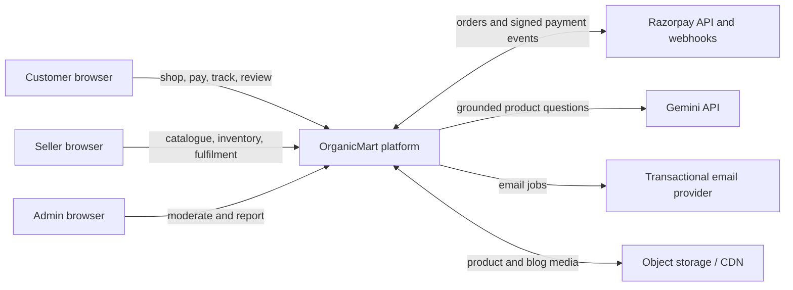
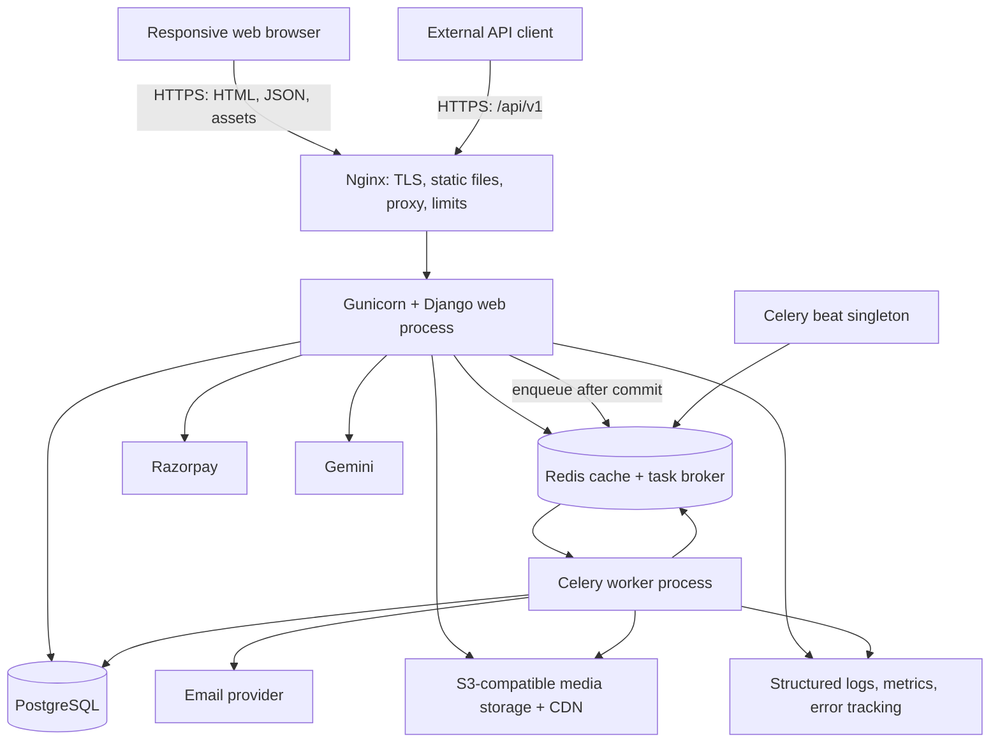
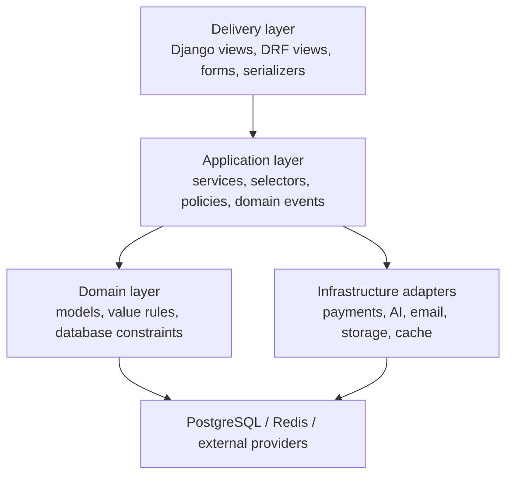

# 1. Software Architecture

## 1.1 System goals

OrganicMart must provide a trustworthy marketplace for three actor groups:

- Customers discover products, manage carts and wishlists, pay, track orders,
  review verified purchases, read content, and ask product questions.
- Sellers manage an approved catalogue, stock, fulfilment, and revenue insights.
- Administrators moderate users, sellers, products, reviews, content, orders,
  promotions, and reports.

The architecture prioritizes correctness of orders and payments, secure access,
fast product browsing, traceability of administrative actions, accessibility,
and a design a small team can operate.

## 1.2 Architecture style: modular monolith

OrganicMart will initially be one Django deployment divided into cohesive domain
apps. The browser-facing pages and versioned REST API share the same domain
services and PostgreSQL transaction boundary.

This is an intentional production architecture, not a shortcut:

1. Checkout, stock reservation, payment recording, and order creation often need
   a single reliable transaction.
2. One deployment is easier to test, observe, secure, and operate for an early
   product and portfolio project.
3. Explicit app boundaries prevent a “big ball of mud” and create extraction
   seams if catalogue search, chat, notifications, or analytics later need to
   scale independently.

### Boundary rules

- Views and API views orchestrate HTTP only; business decisions live in services.
- Read-heavy query composition lives in selectors.
- Models enforce local invariants; database constraints enforce durable rules.
- A domain app may import another app's public `services` or `selectors`, but
  should not reach into its private implementation.
- Cross-domain side effects use explicit application events dispatched only
  after a successful database commit.
- Celery tasks receive identifiers, reload current state, and are idempotent.
- Templates never contain pricing, permission, or stock business logic.
- Infrastructure providers are accessed through adapters, not directly from
  views or models.

## 1.3 System context



## 1.4 Runtime architecture



### Runtime responsibilities

| Component | Responsibility | Scaling approach |
|---|---|---|
| Nginx | TLS termination, compression, static delivery, proxying, request limits | Replicate behind a load balancer if needed |
| Django web | HTML pages, REST API, validation, authorization, domain orchestration | Stateless horizontal replicas |
| PostgreSQL | Source of truth for transactional data | Backups, connection pooling, read replicas when justified |
| Redis | Cache, rate-limit counters, Celery broker | Managed Redis with persistence appropriate to broker use |
| Celery worker | Emails, image processing, reports, webhook follow-up work | Scale by queue and workload |
| Celery beat | Scheduled cleanup, abandoned-cart and reporting jobs | Exactly one active scheduler |
| Object storage/CDN | User-uploaded product and blog media | Provider-managed |

## 1.5 Internal application layers



### Request path example: add to cart

1. A Django or DRF view authenticates the caller and parses input.
2. A form or serializer validates shape and primitive values.
3. `cart.services.set_cart_item(...)` checks product saleability and stock policy.
4. The service updates the cart atomically and returns a result DTO.
5. The view returns HTML, a redirect, or a consistent JSON envelope.

### Transaction path example: payment confirmation

```mermaid
sequenceDiagram
    participant B as Browser
    participant D as Django
    participant P as PostgreSQL
    participant R as Razorpay
    participant W as Celery worker

    B->>D: Start checkout
    D->>P: Validate cart and lock relevant stock
    D->>P: Create pending order and reservations
    D->>R: Create provider order with idempotency reference
    R-->>D: Provider order ID
    D-->>B: Checkout payload
    B->>R: Complete payment
    R->>D: Signed webhook
    D->>D: Verify signature and event freshness
    D->>P: Lock payment/order; record event once
    D->>P: Mark paid and confirm stock transactionally
    D-->>R: 2xx acknowledgement
    D->>W: Enqueue confirmation after commit
    W->>B: Send confirmation email
```

The browser callback improves user experience but is not the payment source of
truth. A verified, deduplicated provider webhook confirms payment.

## 1.6 Domain modules

| Django app | Owns | Does not own |
|---|---|---|
| `core` | Base models, shared exceptions, health checks, audit primitives | Business entities |
| `accounts` | Custom user, authentication state, profiles, addresses | Seller approval |
| `sellers` | Seller onboarding, approval, seller business profile | Products or payments |
| `catalog` | Categories, products, images, certifications, discovery queries | Physical stock |
| `inventory` | Stock records, reservations, stock movements | Product descriptions |
| `promotions` | Coupons, eligibility, redemptions, discount calculation | Payment capture |
| `cart` | Carts and cart items | Final order history |
| `wishlist` | Customer wishlist items | Stock reservation |
| `shipping` | Zones, methods, rates, and delivery quote calculation | Shipment fulfilment decisions |
| `orders` | Immutable order snapshots, status transitions, shipments | Provider payment details |
| `payments` | Razorpay orders, payments, refunds, webhook inbox | Fulfilment |
| `reviews` | Verified-purchase ratings, reviews, moderation | Product catalogue data |
| `blog` | Articles, categories, tags, SEO publishing | Product data |
| `marketing` | Newsletter consent, testimonials, homepage campaigns | Transactional order email |
| `notifications` | Notification preferences, delivery records, templates | Order decisions |
| `assistant` | Chat conversations, grounding, AI provider adapter | Authoritative product answers |
| `analytics` | Aggregated seller/admin read models and report jobs | Transactional source-of-truth records |
| `api` | API routing, schema composition, shared API concerns | Domain logic |

## 1.7 Web and API delivery

### Server-rendered web

- Django templates provide indexable catalogue, product, and blog pages.
- Bootstrap components are extended through a small design-token layer.
- Progressive enhancement keeps core shopping flows functional without
  JavaScript where practical.
- Fetch API powers live search, cart fragments, wishlist actions, and chatbot
  interactions.
- Accessible landmarks, keyboard navigation, visible focus, labelled forms,
  meaningful alt text, and reduced-motion preferences are requirements.

### REST API

- Base path: `/api/v1/`.
- OpenAPI schema: `/api/schema/`; interactive documentation is enabled in
  non-production or protected appropriately in production.
- JWT access tokens are short lived; refresh tokens rotate and are blacklisted
  after use. Browser pages continue to prefer secure cookie sessions.
- Pagination, filtering, ordering, throttling, and error envelopes are
  standardized.
- Public reads expose only approved and active records.
- Mutating seller/admin endpoints require role plus object-level ownership or
  staff policy checks.
- Breaking changes require a new API version; additive fields do not.

Planned resource groups:

| Resource | Representative endpoints |
|---|---|
| Auth | `/auth/token/`, `/auth/token/refresh/`, `/auth/register/`, `/auth/verify-email/` |
| Catalogue | `/categories/`, `/products/`, `/products/{slug}/`, `/search/suggestions/` |
| Cart/wishlist | `/cart/`, `/cart/items/`, `/wishlist/items/` |
| Orders | `/orders/`, `/orders/{number}/`, `/orders/{number}/cancel/` |
| Payments | `/payments/razorpay/create/`, `/webhooks/razorpay/` |
| Reviews | `/products/{id}/reviews/`, `/reviews/{id}/` |
| Blog | `/blog/posts/`, `/blog/posts/{slug}/` |
| Seller | `/seller/products/`, `/seller/inventory/`, `/seller/orders/`, `/seller/analytics/` |
| Assistant | `/assistant/conversations/`, `/assistant/messages/` |

## 1.8 Authentication and authorization

### Identity

- A custom `User` model is created in the first migration and uses normalized,
  unique email as the login identifier.
- Passwords use Django's configured password hashers; raw passwords are never
  logged or stored.
- Email verification is required before high-risk actions such as checkout or
  seller application.
- Password reset tokens are single-purpose, time-limited Django tokens.
- Optional MFA can be added for seller and administrator accounts without
  changing the domain model.

### Authorization policy matrix

| Action | Customer | Seller | Administrator |
|---|---:|---:|---:|
| Browse approved products/blogs | Yes | Yes | Yes |
| Manage own profile/addresses | Own | Own | As authorized support staff |
| Manage cart/wishlist | Own | Own customer context | No routine access |
| Submit review | Verified own purchase | Verified own purchase | Moderate only |
| Manage seller catalogue/stock | No | Own approved seller account | All |
| Change fulfilment status | No | Own order items within allowed transition | All within policy |
| Approve products/sellers | No | No | Permission required |
| View platform reports | No | Own seller data | Permission required |

Role labels alone are insufficient. Every protected operation also checks object
ownership, account status, and allowed state transition.

## 1.9 Security architecture

### Application controls

- Django CSRF middleware protects cookie-authenticated unsafe requests.
- Templates auto-escape output; rich blog HTML is sanitized against an explicit
  allowlist before storage or rendering.
- Django ORM parameterization prevents SQL injection when used correctly; raw SQL
  is exceptional, reviewed, and parameterized.
- Secure, HTTP-only, SameSite cookies; HTTPS redirect; HSTS; trusted proxy and
  host settings; and restrictive CORS configuration are production defaults.
- A Content Security Policy restricts scripts, styles, images, frames, and
  connections to known origins, including the minimum Razorpay requirements.
- Login, password reset, live search, coupon, review, checkout, webhook, and AI
  endpoints have tailored throttles.
- Uploaded files are validated by actual content, bounded by size and dimensions,
  renamed, stored outside the application code path, and never executed.
- All redirect targets and user-supplied URLs are validated.
- Secrets exist only in environment/secret storage and are never committed.

### Payment controls

- Prices, discounts, tax, and shipping are recalculated on the server at checkout.
- Razorpay signatures use constant-time verified provider utilities.
- Webhook events have a unique provider event ID and persistent processing state.
- Payment and refund operations use internal idempotency keys.
- No card data passes through or is stored by OrganicMart.
- Order/payment state transitions are explicit and audited.

### AI assistant controls

- The assistant answers from an allowlisted, server-built product and policy
  context; the model is not a source of truth for price, stock, medical claims,
  certification, delivery promises, or refunds.
- System instructions mark catalogue text and user messages as untrusted data.
- Tool access is allowlisted and read-only in the first release.
- Output is length limited, rendered as text, and accompanied by links to
  authoritative product or policy pages.
- Per-user/IP limits, timeouts, provider circuit breaking, and cost budgets apply.
- Sensitive user data and secrets are removed before provider calls and logs.
- The UI clearly identifies generated answers and provides a safe fallback.

### Operational controls

- Least-privilege PostgreSQL, object-storage, Redis, and provider credentials.
- Dependency locking, automated vulnerability checks, and regular updates.
- Encrypted transport everywhere; encrypted managed storage and backups.
- Daily automated backups plus periodic restore tests.
- Structured audit records for approvals, moderation, refunds, and privileged
  state changes.
- Retention and deletion policies for addresses, chat records, logs, and inactive
  accounts.

## 1.10 Consistency, concurrency, and idempotency

- Monetary amounts use `Decimal`, never floating point, and store an ISO currency.
- Order items snapshot product name, SKU, unit price, discount, tax, and seller so
  catalogue edits cannot rewrite history.
- Inventory mutation uses database transactions, row locks, and append-only stock
  movements. Available stock is `on_hand - reserved`.
- Unique constraints prevent duplicate cart items, wishlist items, reviews,
  coupon redemptions, and webhook processing.
- Explicit state machines reject invalid order, shipment, payment, refund, seller,
  product, and review transitions.
- External side effects are queued with `transaction.on_commit`.
- Tasks and webhooks can run more than once safely.
- A periodic reconciliation job compares internal payments with Razorpay records
  and reports exceptions rather than silently changing money state.

## 1.11 Performance and scalability

- Catalogue and blog list queries use deliberate `select_related`, `prefetch_related`,
  projection, pagination, and query-count tests.
- PostgreSQL indexes support publication status, category, seller, slug, SKU,
  price, creation date, and status/time access patterns.
- PostgreSQL full-text and trigram search are the initial search engine. A search
  adapter permits later migration to OpenSearch without changing views.
- Redis caches category navigation, featured products, published blog fragments,
  and rate counters; cache invalidation follows domain changes.
- Product rating summaries and dashboard aggregates are denormalized read models,
  rebuilt from transactional records when needed.
- Images have responsive sizes, modern formats, lazy loading, fixed dimensions,
  and CDN caching.
- Static assets are content-hashed and served with long cache lifetimes.
- Request timeouts and maximum page sizes protect database and worker capacity.

## 1.12 Observability and operations

Every request receives a correlation ID. Logs are structured and include safe
identifiers, latency, route, response status, and actor category without passwords,
tokens, full addresses, or payment secrets.

Minimum operational signals:

- HTTP rate, latency, errors, and saturation.
- PostgreSQL connection use, slow queries, locks, and storage.
- Cache hit rate and Redis memory.
- Celery queue age, task failures, retries, and dead letters.
- Checkout conversion, payment success/failure, refund exceptions.
- Webhook age and duplicate/failure counts.
- Stock reservation expiry and oversell attempts.
- Email and AI-provider failure, latency, and cost signals.

Health endpoints are separate:

- `/health/live/` proves the process is running and makes no dependency calls.
- `/health/ready/` verifies essential dependencies with tight timeouts.

## 1.13 Deployment environments

| Environment | Purpose | Important differences |
|---|---|---|
| Local | Development and learning | SQLite/PostgreSQL option, console email, debug toolbar |
| Test/CI | Deterministic automated checks | Disposable PostgreSQL/Redis, fake providers |
| Staging | Production-like acceptance | Sandbox Razorpay/Gemini, protected access |
| Production | Real users and money | Debug off, managed secrets, TLS, backups, alerts |

Configuration follows environment variables with startup validation. Development
conveniences must never silently become production defaults.

## 1.14 Key architecture decisions to remember for interviews

1. **Why not microservices?** A modular monolith preserves transactions and
   reduces operational overhead while keeping clear extraction boundaries.
2. **Why server-rendered pages plus API?** Server rendering improves SEO and first
   load; the API supports progressive interactions and future clients.
3. **Why order snapshots?** Historical financial records must not change when a
   seller edits a product.
4. **Why webhook source of truth?** Browser callbacks can be interrupted or forged;
   signed provider events are independently verifiable and retryable.
5. **How is overselling prevented?** Atomic row locking, reservations, stock
   movements, and expiration/reconciliation jobs.
6. **How does it scale?** Stateless web replicas, background queues, caching,
   indexed access patterns, CDN media, and replaceable adapters around search and
   external providers.
