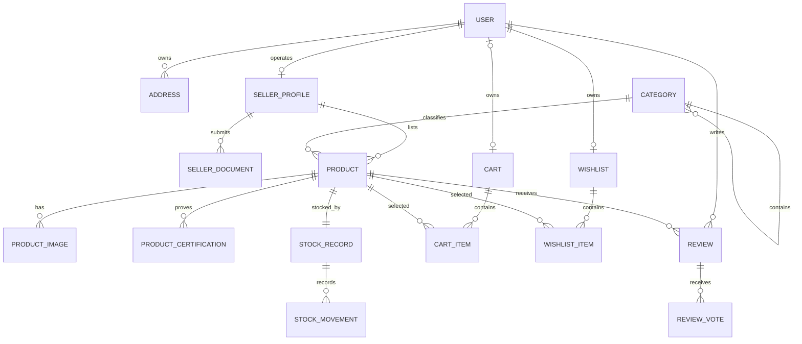
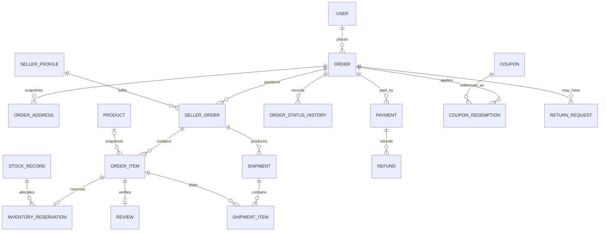
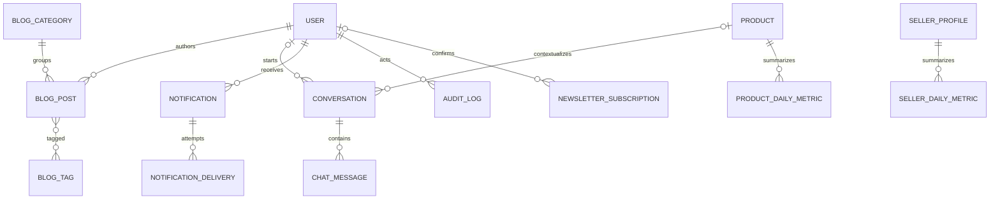

# 2. Database Design

## 2.1 Design principles

PostgreSQL is the system of record. The schema is relational and deliberately
normalized for correctness, with a few documented summary fields for fast reads.

- Primary keys are UUIDs so identifiers are safe to expose and can be generated
  independently. Human-facing orders also receive a non-guessable order number.
- All timestamps are timezone-aware and stored in UTC.
- Money uses `numeric(12,2)` through Django `DecimalField`, plus a three-character
  ISO currency code. Floating-point values are forbidden for money.
- `created_at` and `updated_at` exist on mutable business records.
- User-owned and financial records are not physically deleted during ordinary
  workflows. Statuses or archival timestamps preserve history.
- Foreign-key deletion behavior is intentional: `PROTECT` for financial history,
  `CASCADE` only for true owned children, and `SET_NULL` when a historical snapshot
  remains meaningful without its source record.
- Important business invariants have database `CHECK` and `UNIQUE` constraints in
  addition to service-layer validation.
- Mutable status fields are changed only through named transition services.
- Personally identifiable information is minimized, access-controlled, excluded
  from logs, and retained only as long as policy requires.

The PostgreSQL `pg_trgm` extension supports typo-tolerant suggestions. PostgreSQL
full-text search is the first search implementation. Both are enabled through
versioned Django migrations, not manual production steps.

## 2.2 High-level entity relationship diagram

The full schema is split into three diagrams so the relationships stay readable.

### Identity, sellers, catalogue, and engagement

### Checkout, fulfilment, and payments

### Content, communication, and reporting

## 2.3 Identity and access schema

### `accounts_user`

Custom authentication model created before any other app migration.

| Column | Type | Rules / meaning |
|---|---|---|
| `id` | UUID | Primary key |
| `email` | varchar(254) | Normalized, case-insensitive unique login identifier |
| `first_name`, `last_name` | varchar | Profile names; bounded lengths |
| `phone_number` | varchar | Optional E.164 normalized value; unique only when present and verified |
| `email_verified_at` | timestamptz | Null until verified |
| `phone_verified_at` | timestamptz | Optional future verification |
| `status` | varchar | `ACTIVE`, `SUSPENDED`, `DEACTIVATED` |
| `is_active` | boolean | Django authentication gate |
| `is_staff`, `is_superuser` | boolean | Django admin controls; permissions still required |
| `last_login`, `date_joined` | timestamptz | Authentication metadata |
| `password` | varchar | Django password hash only |
| `created_at`, `updated_at` | timestamptz | Audit timestamps |

Constraints and indexes:

- Unique index on `lower(email)`.
- Conditional unique index on normalized phone when non-null.
- Index on `(status, created_at)` for administration.
- Django groups and permissions represent staff capabilities; seller status is
  represented by the seller profile rather than an insecure client-supplied role.

### `accounts_address`

| Column | Type | Rules / meaning |
|---|---|---|
| `id`, `user_id` | UUID, FK | Address belongs to one user |
| `label` | varchar(40) | Example: Home, Work |
| `recipient_name`, `phone_number` | varchar | Delivery contact |
| `line1`, `line2` | varchar | Postal lines |
| `city`, `state`, `postal_code`, `country_code` | varchar | ISO country code; normalized postal code |
| `address_type` | varchar | `SHIPPING`, `BILLING`, `BOTH` |
| `is_default_shipping`, `is_default_billing` | boolean | At most one of each per user |
| `is_active` | boolean | Archived instead of deleting referenced data |
| `created_at`, `updated_at` | timestamptz | Audit timestamps |

Partial unique constraints enforce one active default shipping address and one
active default billing address per user. Orders copy addresses into immutable
order snapshots; they never depend on this mutable table after checkout.

### `accounts_email_verification`

Stores a hash of the one-time token, never the token itself. Columns include
`user_id`, `token_digest`, `expires_at`, `used_at`, `created_at`, and request IP
hash. Only one usable verification per purpose is maintained by the service.

## 2.4 Seller schema

### `sellers_sellerprofile`

| Column | Type | Rules / meaning |
|---|---|---|
| `id`, `user_id` | UUID, one-to-one FK | One seller application per user |
| `business_name`, `slug` | varchar | Public identity; unique slug |
| `legal_name` | varchar | Private registered name |
| `description`, `logo`, `banner` | text/media | Public storefront content |
| `support_email`, `support_phone` | varchar | Customer-facing contacts |
| `tax_identifier` | encrypted/bounded varchar | Sensitive; restricted display |
| `status` | varchar | `DRAFT`, `PENDING`, `APPROVED`, `REJECTED`, `SUSPENDED` |
| `commission_rate` | numeric(5,2) | Between 0 and 100; copied to seller orders |
| `return_policy` | text | Sanitized seller policy within platform rules |
| `submitted_at`, `approved_at` | timestamptz | Workflow timestamps |
| `approved_by_id` | nullable FK user | Staff actor |
| `rejection_reason` | text | Private workflow detail |
| `created_at`, `updated_at` | timestamptz | Audit timestamps |

Indexes: unique `slug`, `(status, submitted_at)`, and `user_id`. Approval and
suspension changes create audit-log entries.

### `sellers_sellerdocument`

Owned child with `seller_id`, `document_type`, private `file`, masked
`reference_number`, `status`, `reviewed_by_id`, `reviewed_at`, `expires_at`, and
timestamps. Document access uses short-lived private object-storage URLs.

## 2.5 Catalogue schema

### `catalog_category`

| Column | Type | Rules / meaning |
|---|---|---|
| `id`, `parent_id` | UUID, self FK | Bounded category hierarchy |
| `name`, `slug` | varchar | Unique public slug |
| `description`, `image`, `icon` | text/media | Navigation content |
| `meta_title`, `meta_description` | varchar | Search metadata |
| `is_active`, `is_featured` | boolean | Visibility flags |
| `sort_order` | positive integer | Stable navigation ordering |
| `created_at`, `updated_at` | timestamptz | Audit timestamps |

The service rejects cycles and limits tree depth. Initial seed categories are
Fruits, Vegetables, Organic Grains, Honey, Herbal Products, Spices, Tea, and Dry
Fruits.

### `catalog_product`

| Column | Type | Rules / meaning |
|---|---|---|
| `id`, `seller_id`, `category_id` | UUID, FK | Approved seller and category ownership |
| `name`, `slug` | varchar | Seller-scoped slug uniqueness; SEO URL |
| `sku` | varchar(64) | Seller-scoped, case-insensitive unique value |
| `short_description`, `description` | text | Sanitized/controlled product copy |
| `benefits`, `ingredients`, `usage_instructions` | text | Grounding content for product pages and chat |
| `base_price` | numeric(12,2) | Greater than or equal to zero |
| `discount_percent` | numeric(5,2) | Between 0 and 100 |
| `currency` | char(3) | Initially `INR` |
| `unit_label` | varchar(40) | Example: `500 g`, for clear commerce display |
| `status` | varchar | `DRAFT`, `PENDING`, `ACTIVE`, `REJECTED`, `ARCHIVED` |
| `is_featured` | boolean | Staff-curated merchandising flag |
| `average_rating` | numeric(3,2) | Denormalized published-review summary, 0–5 |
| `review_count` | nonnegative integer | Denormalized published-review count |
| `meta_title`, `meta_description` | varchar | SEO overrides |
| `approved_by_id`, `approved_at` | nullable staff FK/time | Moderation record |
| `rejection_reason` | text | Seller-visible moderation feedback |
| `published_at`, `created_at`, `updated_at` | timestamptz | Lifecycle timestamps |

Constraints and indexes:

- Unique `(seller_id, lower(sku))` and `(seller_id, slug)`.
- Checks for valid price, discount, average rating, and review count.
- B-tree indexes on `(status, category_id, created_at)`, `(status, seller_id)`,
  `(status, is_featured)`, and effective sort fields.
- GIN full-text index over weighted name, category, description, and seller name.
- Trigram indexes over product name and SKU for suggestions/admin lookup.
- Stock is exposed on product screens but is owned by `inventory_stockrecord`; a
  duplicated mutable `product.stock` column would create two sources of truth.

### `catalog_productimage`

Columns: `product_id`, `image`, `alt_text`, `sort_order`, `is_primary`, image
dimensions, and timestamps. A partial unique constraint allows only one primary
image per product, while `(product_id, sort_order)` is unique.

### `catalog_productcertification`

Columns: `product_id`, `name`, `certification_number`, `issuing_authority`,
`issued_at`, `expires_at`, private/public document or badge image, `status`
(`PENDING`, `VERIFIED`, `REJECTED`, `EXPIRED`), `verified_by_id`, `verified_at`,
and timestamps. A product is described as certified only from a current verified
record; the AI assistant cannot infer certification from marketing text.

## 2.6 Inventory schema

### `inventory_stockrecord`

| Column | Type | Rules / meaning |
|---|---|---|
| `id`, `product_id` | UUID, one-to-one FK | One stock ledger per product in version one |
| `on_hand` | nonnegative integer | Physically held units |
| `reserved` | nonnegative integer | Units reserved by pending orders |
| `reorder_level` | nonnegative integer | Seller alert threshold |
| `allow_backorder` | boolean | Defaults false; tightly controlled |
| `version` | positive integer | Supports optimistic diagnostics |
| `updated_at` | timestamptz | Last mutation |

Checks enforce `reserved <= on_hand` unless backorders are explicitly enabled.
Available quantity is calculated as `on_hand - reserved`; every mutation locks the
stock row and writes a movement in the same transaction.

### `inventory_stockmovement`

Append-only ledger with `stock_record_id`, signed `quantity_delta`,
`movement_type` (`RECEIPT`, `ADJUSTMENT`, `RESERVE`, `RELEASE`, `SALE`, `RETURN`),
`reference_type`, `reference_id`, `reason`, `actor_id`, `idempotency_key`, and
`created_at`. The idempotency key is unique. Deleting or editing movements through
normal application paths is forbidden.

### `inventory_inventoryreservation`

Columns: `stock_record_id`, unique `order_item_id`, `quantity`, `status`
(`ACTIVE`, `CONFIRMED`, `RELEASED`, `EXPIRED`), `expires_at`, `idempotency_key`,
and timestamps. Active reservations are indexed by `expires_at` for cleanup. Cart
items do not reserve stock; stock is revalidated during checkout.

## 2.7 Cart, wishlist, shipping, and promotion schema

### `cart_cart` and `cart_cartitem`

`cart_cart` has `user_id` (unique for authenticated customers), optional secure
`session_key_hash` for guest carts, `currency`, `expires_at`, and timestamps.

`cart_cartitem` has `cart_id`, `product_id`, positive `quantity`, and timestamps.
Unique `(cart_id, product_id)` prevents duplicate lines. Display totals are always
computed from current server-side catalogue and promotion data; the cart never
stores client-provided prices.

### `wishlist_wishlist` and `wishlist_wishlistitem`

One wishlist per user. Items have `wishlist_id`, `product_id`, and `created_at`,
with unique `(wishlist_id, product_id)`.

### `shipping_shippingzone`, `shipping_shippingmethod`, `shipping_shippingrate`

- A zone groups supported country/state/postal rules with a stable priority.
- A method defines name, carrier, tracking support, estimated minimum/maximum
  business days, and active status.
- A rate connects zone and method with minimum/maximum order value, base charge,
  optional free-shipping threshold, currency, and effective dates.

The shipping service receives an address and priced basket and returns eligible
quotes. The selected quote is copied onto the order; later rate edits do not alter
existing orders.

### `promotions_coupon`

Columns include `code` (case-insensitive unique), `discount_type` (`FIXED`,
`PERCENT`), `value`, `currency`, `minimum_order_value`, `maximum_discount`, global
and per-user usage limits, valid date range, active flag, and optional seller or
category eligibility through relation tables. Checks make type-specific values
valid.

### `promotions_couponredemption`

Links `coupon_id`, `user_id`, and unique `order_id`, with snapshotted code and
discount amount. A unique constraint across coupon/user/order and transactional
counter checks enforce limits. Cancelled unpaid orders release eligibility by an
explicit service policy, never by deleting audit history.

## 2.8 Order and fulfilment schema

### `orders_order`

| Column | Type | Rules / meaning |
|---|---|---|
| `id`, `user_id` | UUID, FK | Customer order |
| `number` | varchar | Unique, non-sequential public reference |
| `status` | varchar | `PENDING`, `PROCESSING`, `SHIPPED`, `DELIVERED`, `CANCELLED` |
| `payment_status` | varchar | `UNPAID`, `AUTHORIZED`, `PAID`, `PARTIALLY_REFUNDED`, `REFUNDED`, `FAILED` |
| `currency` | char(3) | Currency for all order money columns |
| `subtotal`, `discount_total`, `shipping_total`, `tax_total`, `grand_total` | numeric(12,2) | Server-calculated immutable financial summary after confirmation |
| `shipping_method_name` | varchar | Selected quote snapshot |
| `shipping_eta_min`, `shipping_eta_max` | date | Optional customer estimate snapshot |
| `customer_note` | bounded text | Sanitized fulfilment note |
| `placed_at`, `cancelled_at`, `completed_at` | timestamptz | Lifecycle timestamps |
| `created_at`, `updated_at` | timestamptz | Audit timestamps |

Checks enforce nonnegative components and
`grand_total = subtotal - discount_total + shipping_total + tax_total` within the
single currency. Indexes support `(user_id, created_at)`, `(status, created_at)`,
and unique `number`.

### `orders_orderaddress`

Immutable copy of shipping or billing address: `order_id`, `address_type`,
recipient/contact and full postal fields. Unique `(order_id, address_type)` allows
one of each. It has no foreign key to the mutable customer address.

### `orders_sellerorder`

One order partition per seller, containing `order_id`, `seller_id`, unique public
`number`, fulfilment `status`, snapshotted commission rate/amount, subtotal,
discount allocation, shipping allocation, tax, seller net amount, and timestamps.
Unique `(order_id, seller_id)` supports multi-seller checkout and seller-scoped
authorization.

### `orders_orderitem`

| Column | Type | Rules / meaning |
|---|---|---|
| `id`, `seller_order_id` | UUID, FK | Owned by seller partition |
| `product_id` | nullable FK | Source link retained when possible |
| `product_name`, `product_slug`, `sku`, `unit_label` | varchar | Immutable catalogue snapshot |
| `seller_name` | varchar | Immutable seller snapshot |
| `quantity` | positive integer | Purchased units |
| `unit_price`, `unit_discount`, `unit_tax`, `line_total` | numeric(12,2) | Immutable server-calculated amounts |
| `fulfilment_status` | varchar | Item-level state for partial operations |
| `created_at`, `updated_at` | timestamptz | Audit timestamps |

`line_total = quantity * (unit_price - unit_discount + unit_tax)` is validated.
Order items are never silently rewritten when catalogue data changes.

### Status and shipment tables

- `orders_orderstatushistory`: order, previous/new status, actor, reason, metadata,
  timestamp. Append-only.
- `orders_shipment`: seller order, carrier, service, tracking number/URL, status,
  shipped/delivered timestamps, and timestamps.
- `orders_shipmentitem`: shipment, order item, positive quantity; unique pair and
  aggregate shipped quantity cannot exceed the ordered quantity.
- `orders_returnrequest`: order, customer, reason, detail, requested resolution,
  status, reviewed actor/time, and timestamps. Child return items identify order
  items and quantities; approved refunds are handled by the payment domain.

Allowed transitions are explicit. For example, `DELIVERED -> PROCESSING` is not a
valid correction; privileged corrections use a dedicated audited workflow.

## 2.9 Payment schema

### `payments_payment`

| Column | Type | Rules / meaning |
|---|---|---|
| `id`, `order_id` | UUID, FK | An order can have multiple attempts |
| `provider` | varchar | Initially `RAZORPAY` |
| `provider_order_id` | varchar | Unique when assigned |
| `provider_payment_id` | varchar | Unique when assigned |
| `idempotency_key` | UUID/varchar | Unique internal operation key |
| `status` | varchar | `CREATED`, `AUTHORIZED`, `CAPTURED`, `FAILED`, `CANCELLED` |
| `amount`, `currency` | numeric/char | Must match intended order payment |
| `failure_code`, `failure_message` | bounded varchar | Sanitized provider result |
| `authorized_at`, `captured_at`, `failed_at` | timestamptz | Lifecycle timestamps |
| `provider_metadata` | jsonb | Allowlisted non-secret diagnostic fields only |
| `created_at`, `updated_at` | timestamptz | Audit timestamps |

### `payments_refund`

Links payment and order with internal and unique provider refund IDs, idempotency
key, amount, reason, status (`REQUESTED`, `PROCESSING`, `SUCCEEDED`, `FAILED`),
requesting actor, provider metadata, and timestamps. Transactional checks ensure
successful refund totals never exceed captured payment.

### `payments_webhookevent`

Persistent inbox with provider, unique provider event ID, event type, payload
digest, safely bounded encrypted/raw payload according to retention policy,
signature-valid flag, processing status, attempt count, last error, received,
processed, and next-retry timestamps. The endpoint stores/deduplicates before
processing and returns provider-compatible responses.

## 2.10 Review schema

### `reviews_review`

Columns: `product_id`, `user_id`, unique `order_item_id`, integer `rating`, title,
body, status (`PENDING`, `PUBLISHED`, `REJECTED`, `HIDDEN`), moderation reason and
actor/time, `is_verified_purchase` (derived and immutable true at creation), and
timestamps.

Constraints:

- Rating is between 1 and 5.
- One review per purchased order item.
- The service verifies the order item belongs to the user, references the product,
  and is delivered before insertion.
- Public selectors return only `PUBLISHED` reviews.

`reviews_reviewvote` links review and user with a helpful boolean and unique
`(review_id, user_id)`. Product rating summary updates after commit and can be
fully rebuilt from published rows.

## 2.11 Blog and marketing schema

### `blog_blogcategory`, `blog_blogtag`, `blog_blogpost`

- Category: name, unique slug, description, and active status.
- Tag: name and unique slug.
- Post: author, category, title, unique slug, excerpt, sanitized rich content,
  featured image and alt text, status (`DRAFT`, `SCHEDULED`, `PUBLISHED`,
  `UNPUBLISHED`), featured flag, meta title/description, canonical URL, publish
  date, timestamps, and optional soft archive time.
- The post/tag join table has a unique post/tag pair.

Indexes cover `(status, publish_at)`, category publication, featured publication,
full-text title/content, and trigram title search. Scheduled publishing uses an
idempotent task, while selectors also require `publish_at <= now()` so a late task
cannot expose a future article incorrectly.

### `marketing_newslettersubscription`

Columns: normalized email, optional user, status (`PENDING`, `ACTIVE`,
`UNSUBSCRIBED`), consent source/version, confirmation token digest, confirmed and
unsubscribed timestamps, and timestamps. Subscription uses double opt-in and every
email includes a scoped unsubscribe token.

### `marketing_testimonial`

Staff-curated homepage record with display name, optional user, quote, image,
rating, source/consent note, active flag, sort order, and timestamps. Public
testimonials are never copied from private reviews without explicit consent.

## 2.12 Assistant and notification schema

### `assistant_conversation` and `assistant_chatmessage`

- Conversation: optional authenticated user, optional product context, secure
  guest-session hash, status, provider/model alias, last activity, expiry, and
  timestamps.
- Message: conversation, role (`USER`, `ASSISTANT`, `SYSTEM_EVENT`), bounded plain
  content, response status, token/cost counters where available, safety outcome,
  latency, error category, and timestamp.

Raw provider secrets, hidden system prompts, addresses, payment details, and
unbounded payloads are not stored. Expired conversations are purged or anonymized
by retention policy. An optional `assistant_groundingcitation` child links an
assistant message to a product/policy identifier and version.

### `notifications_notification` and delivery records

- Notification: recipient user, type, title, bounded message, action URL, read
  time, immutable domain reference type/ID, and timestamp.
- Delivery: notification, channel (`EMAIL`, future `SMS`/`PUSH`), destination
  hash/masked display, status, provider message ID, attempt count, next attempt,
  sent/delivered/failed times, and sanitized error.
- Preference: unique user/event/channel rows allow opt-out for marketing but not
  legally or operationally necessary transactional messages.

## 2.13 Audit and analytics schema

### `core_auditlog`

Append-only record with actor, action, target type/UUID, correlation ID, request IP
hash, user-agent summary, before/after changed-field JSON (sensitive fields
redacted), reason, and timestamp. Indexes support target history, actor history,
action/time, and correlation lookup.

### Analytics read models

`analytics_sellermetricdaily` and `analytics_productmetricdaily` store a UTC/IST
business date, seller/product keys, order counts, units, gross sales, discount,
refunds, net revenue, and view/conversion counters. Natural date/entity keys are
unique. These rows are derived, not financial source-of-truth records, and can be
rebuilt from orders, payments, and event aggregates.

## 2.14 Important cross-table invariants

Some rules cannot be expressed as a simple PostgreSQL row constraint and must be
implemented inside atomic services with row locks:

1. A seller may submit products only while approved; suspension hides its active
   products from new purchases without erasing order history.
2. An order item seller must match its seller-order seller and source product
   seller.
3. A review user/product must match its delivered order item.
4. Captured payment and successful refund sums must respect order/payment totals.
5. Reserved stock and shipped quantities cannot exceed available/purchased units.
6. Coupon limits are checked and redeemed under locks during checkout.
7. Product rating summaries equal aggregates of currently published reviews.
8. Parent categories cannot form cycles.

These services receive concurrency tests, not only happy-path unit tests.

## 2.15 Data lifecycle

| Data | Normal lifecycle |
|---|---|
| Products/categories | Archive or unpublish; retain references for orders |
| Orders/payments/refunds | Retain per financial and legal policy; never user-deleted |
| Customer addresses | Archive mutable records; retain protected order snapshots as required |
| Seller documents | Private storage, restricted access, expiry and retention jobs |
| Chat conversations | Short configurable retention, then delete/anonymize |
| Webhook payloads | Retain only fields/duration needed for dispute and debugging policy |
| Audit logs | Append-only, access controlled, time-partition if volume justifies it |
| Analytics summaries | Rebuildable; partition/archive by date when needed |

Backups use point-in-time recovery where available. A backup is considered valid
only after a documented restore exercise succeeds.
