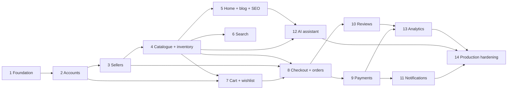

# 4. Development Roadmap

## 4.1 How the project will be built

OrganicMart will be implemented in vertical, testable slices. A slice includes its
model, migration, service, authorization, HTML experience, API, tests,
documentation, and operational behavior. We will not create every model first and
leave a disconnected pile of code.

For a learner, every implementation module will explain:

1. The user problem and business rule.
2. The request path from URL to view to service to database to response.
3. Why each file exists and which layer owns each decision.
4. Security and concurrency risks relevant to that module.
5. How to run it and how tests prove it works.
6. The engineering trade-offs you can discuss in an interview.

## 4.2 Quality gate used in every phase

A phase is complete only when all relevant items pass:

- Acceptance criteria work through the browser and API where applicable.
- Models have reviewed migrations, constraints, and indexes.
- Business mutations use services and explicit authorization policies.
- Unit, integration, permission, negative-path, and regression tests pass.
- No unbounded list endpoint or obvious N+1 query remains.
- Forms/API errors are useful and do not expose internals.
- Mobile, keyboard, empty, loading, and error states are checked.
- Structured logs avoid secrets and personal/payment data.
- Formatting, linting, type checks, migration drift checks, Django system/deploy
  checks, dependency audit, and test suite pass.
- The module documentation and `.env.example` are current.

## 4.3 Milestone roadmap

### Phase 0 — Architecture baseline (current)

Deliverables:

- Software/runtime/layer architecture and security model.
- PostgreSQL entity relationships, schema dictionary, and invariants.
- Repository and Django app boundaries.
- Incremental delivery roadmap and definition of done.

Exit gate: the required business capabilities have an owner, critical transaction
flows are understood, and no code scaffolding decision conflicts with the custom
user model or production deployment plan.

### Phase 1 — Engineering foundation

Build:

- Python virtual environment instructions and pinned dependency workflow.
- Django project, split settings, custom user model skeleton in the first migration.
- PostgreSQL-ready local settings and direct virtual-environment workflow.
- Base model, service exceptions, health checks, correlation IDs, structured logs.
- Root templates, Bootstrap-based design tokens, accessible header/footer/messages.
- DRF base configuration, `/api/v1`, standardized errors, pagination, OpenAPI,
  session/JWT strategy.
- Celery configuration with one demonstrative idempotent task.
- Static/media strategy, `.env.example`, Git ignore, pre-commit and CI checks.
- Initial test factories and test database setup on PostgreSQL.

Acceptance checks:

- A fresh clone can start with documented commands.
- `/`, `/health/live/`, `/health/ready/`, and protected API documentation behave
  correctly.
- Local/test/production settings pass their intended checks; production refuses
  unsafe or missing configuration.
- The empty responsive shell works at phone, tablet, and desktop widths.

Engineering lesson: project bootstrapping, environment configuration, dependency
locking, request middleware, and why the custom user model must exist immediately.

### Phase 2 — Accounts and access control

Build:

- Email-based custom user manager and final account fields.
- Registration with email verification, login/logout, password reset.
- Profile and address management with default-address constraints.
- Session-authenticated pages and rotating JWT endpoints.
- Reusable login, verified-email, staff-permission, and object-ownership policies.
- Transactional email adapter/fake and account email templates.
- Rate limits and safe anti-enumeration responses for auth recovery flows.

Acceptance checks:

- A user can register, verify, sign in, reset a password, edit a profile, and manage
  addresses.
- Duplicate email races are handled gracefully.
- Another user cannot read or mutate profile/address objects by changing an ID.
- Token rotation, expiry, logout/blacklist, CSRF, and throttling tests pass.

Engineering lesson: authentication proves identity; authorization decides whether
that identity may perform a specific action on a specific object.

### Phase 3 — Seller onboarding and administration

Build:

- Seller profile/application and private document storage.
- Submit, approve, reject, suspend, and resubmit workflows.
- Seller dashboard shell and storefront profile.
- Staff permissions and tailored Django Admin actions with confirmation.
- Audit entries and seller notification events.

Acceptance checks:

- Only a verified customer can apply.
- Only explicitly permitted staff can approve/suspend.
- A seller cannot access another seller's documents or dashboard data.
- Private document URLs expire and are never indexed or served publicly.

Engineering lesson: roles are lifecycle state plus permissions and ownership, not
merely a `role=seller` value supplied by the browser.

### Phase 4 — Catalogue, inventory, and product moderation

Build:

- Seeded category hierarchy for all requested organic categories.
- Product, image, certification, stock record, movement, and reservation models.
- Seller add/edit/archive product screens and image management.
- Staff product/certification approval and rejection feedback.
- Customer category/product list/detail pages with filters, sorting, pagination,
  featured content, responsive images, and SEO metadata.
- Catalogue and inventory APIs with seller ownership policies.
- Atomic stock receiving/adjustment service and low-stock indicators.

Acceptance checks:

- Unapproved sellers cannot submit and unapproved products never appear publicly.
- SKU and slug races return helpful errors.
- File type/size/dimension and malicious upload tests pass.
- Seller A cannot change Seller B's product or stock.
- Product list/detail query budgets stay bounded as rows/images grow.

Engineering lesson: catalogue content and inventory are related but distinct
sources of truth with different concurrency rules.

### Phase 5 — Homepage, blog, marketing, and SEO

Build:

- Premium organic design for hero, featured categories/products, benefits,
  testimonials, latest blogs, newsletter, and footer.
- Blog categories, tags, rich-text editor integration, sanitization, editorial
  workflow, featured images, SEO fields, and scheduled publishing.
- Blog list/detail/category/search pages and read APIs.
- Newsletter double opt-in/unsubscribe and curated testimonials.
- Canonical/meta/Open Graph tags, sitemap, and `robots.txt`.
- Performance budget for above-the-fold assets and image optimization task.

Acceptance checks:

- Draft/future posts and unapproved products cannot leak through pages, feeds,
  search, sitemap, or APIs.
- Stored/reflected XSS test payloads render harmlessly.
- Homepage remains useful without JavaScript and responsive at target widths.
- Lighthouse-style accessibility/performance checks meet the documented budget.

Engineering lesson: SEO is a data/publication correctness problem as much as a
meta-tag problem.

### Phase 6 — Search and discovery

Build:

- PostgreSQL weighted full-text product and blog search.
- Trigram suggestions for products, categories, and blog titles.
- AJAX/Fetch live-search dropdown with debounce, cancellation, keyboard support,
  safe text rendering, throttling, and fallback results page.
- Filter/query-string preservation and stable relevance/sort/pagination rules.
- Search adapter interface for future external search engine extraction.

Acceptance checks:

- Only active/approved/published records are searchable.
- Empty, typo, special-character, long, and abusive queries are safe.
- Stale browser responses cannot overwrite newer suggestions.
- Query plan and latency are measured against a realistic seed data volume.

Engineering lesson: indexes must follow actual access patterns; AJAX changes the
interaction but never bypasses server validation or authorization.

### Phase 7 — Cart, wishlist, promotions, and shipping quotes

Build:

- Authenticated/guest cart, merge-on-login, item quantity updates and expiry.
- Wishlist add/remove/move-to-cart.
- Coupon rules, usage limits, deterministic discount calculator.
- Shipping zones/methods/rates and address-based quote service.
- Progressive Fetch interactions with CSRF, accessible live regions, and full-page
  POST fallbacks.
- Cart/wishlist APIs and navbar counters.

Acceptance checks:

- Client-supplied prices, discounts, seller IDs, and totals are ignored.
- Inactive/out-of-stock products produce clear server-side errors.
- Repeated add/move operations are idempotent where the user expects them to be.
- Coupon boundary dates/limits and concurrent redemption tests pass.
- Guest cart data cannot be guessed or attached to another session.

Engineering lesson: the server owns all commerce calculations; a cart is mutable
shopping intent, not an invoice.

### Phase 8 — Checkout, orders, and inventory reservation

Build:

- Checkout address selection/copy, billing option, shipping quote, coupon summary,
  and final server-side recalculation.
- Atomic multi-seller order, seller-order, immutable item/address snapshots, and
  expiring inventory reservations.
- Customer order history/detail and cancel request.
- Seller order queue, allowed fulfilment transitions, shipments, tracking, and
  customer return-request foundation.
- Staff order oversight and append-only status history.
- Order APIs with customer/seller/admin scopes.

Acceptance checks:

- Concurrent checkout for the last item cannot oversell.
- Catalogue/address edits after placement do not change order history.
- Invalid status transitions and cross-seller access fail safely.
- Expired/failed checkout releases inventory exactly once.
- Multi-seller totals and discount/shipping allocations reconcile to the order.

Engineering lesson: transactions, row locks, immutable snapshots, and explicit
state machines protect business truth under concurrency.

### Phase 9 — Razorpay payments and refunds

Build:

- Provider-neutral payment/refund interface and Razorpay sandbox adapter.
- Server-side Razorpay-order creation and browser checkout integration.
- Signature-verified webhook inbox, deduplication, retry processing, and event
  ordering safeguards.
- Captured/failed payment handling, order confirmation, refund workflow, and
  scheduled reconciliation report.
- Redacted logs, secret management, strict webhook/body/rate controls.

Acceptance checks:

- A browser “success” alone never marks an order paid.
- Invalid signatures fail, duplicate events are harmless, and reordered/retried
  events converge to valid state.
- Payment amount/currency must match the server order.
- Refund totals cannot exceed captured value.
- Sandbox happy/failure paths and provider-contract tests pass.

Engineering lesson: external systems deliver events at least once and sometimes
out of order; idempotency turns retries from a threat into normal behavior.

### Phase 10 — Reviews and rating summaries

Build:

- Delivered-purchase review eligibility, star input, written reviews, and customer
  review management.
- Staff moderation and review helpful votes.
- Product average, count, and 1–5 breakdown with reliable rebuild command.
- Review HTML/API views with pagination and seller-safe visibility.

Acceptance checks:

- A user cannot review an unpurchased, undelivered, or another user's order item.
- Ratings outside 1–5 and duplicate purchase-item reviews fail at the database and
  service boundaries.
- Hidden/rejected reviews do not affect published summaries.
- Concurrent moderation/updates leave the summary rebuildable and correct.

Engineering lesson: denormalized summaries accelerate reads but the normalized
reviews remain the rebuildable source of truth.

### Phase 11 — Notifications

Build:

- In-app notification center and read/unread actions.
- Email delivery queue and templates for order confirmation, payment failure,
  shipment updates, delivery, seller new order/low stock, and approval events.
- Preference rules, provider delivery records, retries/backoff, and failed-job
  visibility.
- Transactional outbox or equivalent durable after-commit event handling if simple
  task publication cannot meet reliability tests.

Acceptance checks:

- Database rollbacks never send success notifications.
- Duplicate tasks/events do not send duplicate transactional email.
- Seller events include only that seller's order information.
- Marketing preferences do not disable required transactional messages.

Engineering lesson: slow and failure-prone I/O belongs outside the web response,
but asynchronous work still needs durable state and observability.

### Phase 12 — AI product assistant

Build:

- Floating, accessible chat widget in the base layout.
- Conversation/message endpoints and short retention policy.
- Product/policy grounding service with explicit citations/links.
- Gemini adapter with timeouts, safety configuration, quotas, circuit breaker, and
  deterministic fallback answers.
- Prompt injection defenses, plain-text output rendering, cost/latency metrics,
  and privacy redaction.

Acceptance checks:

- The assistant never invents certification, stock, medical claims, price,
  delivery promise, or return entitlement as authoritative fact.
- Catalogue instructions cannot override system policy or gain tool access.
- Secrets/personal/payment information never enters prompts or logs.
- Provider outage, timeout, rate limit, unsafe result, and missing API key degrade
  gracefully without breaking shopping pages.

Engineering lesson: an LLM is an unreliable external dependency; grounding,
boundaries, validation, and fallback—not a clever prompt alone—make it usable.

### Phase 13 — Seller/admin analytics and operational tools

Build:

- Seller revenue, orders, units, top products, inventory, and date-range dashboard.
- Admin user/seller/product/order/review/blog/category views and platform sales
  dashboard.
- Daily aggregate jobs and rebuild command.
- Permission-checked CSV reports generated asynchronously with expiring downloads.
- Audit viewer, payment/webhook exception queue, stock reconciliation report.

Acceptance checks:

- Seller metrics never include another seller's amounts or customer-private data.
- Dashboard totals reconcile to source orders/payments/refunds for sampled periods.
- Expensive reports do not run inside request-response workers.
- Spreadsheet-formula injection is neutralized in CSV exports.

Engineering lesson: analytics read models optimize questions; transactional tables
remain the authority and make aggregates verifiable.

### Phase 14 — Production hardening and deployment

Build:

- Multi-stage non-root Django image and Nginx image/config.
- Gunicorn worker/timeouts, static collection, media object storage, CDN headers.
- Ubuntu deployment guide with Gunicorn, Nginx, PostgreSQL, and systemd.
- PostgreSQL migrations as a controlled one-off release step.
- Backup, point-in-time recovery configuration, and tested restore runbook.
- TLS, security headers, allowed hosts/origins, secret injection, and firewall plan.
- Metrics, error tracking, log aggregation, alert thresholds, and incident runbooks.
- Dependency scanning, deploy checks, smoke tests, and rollback process.
- Load test for catalogue, search, cart, checkout creation, and webhook bursts.

Acceptance checks:

- Production settings pass `check --deploy` with debug disabled.
- Production services run with least-privilege users, health checks, and no committed secrets.
- Staging deployment, migration, smoke test, backup, restore, and rollback exercises
  succeed from written instructions.
- Payment/stock failure alerts are actionable and tested.
- A release does not require manually editing files on the server.

Engineering lesson: production readiness is the ability to deploy, observe,
recover, and change the system safely—not simply placing it behind Nginx.

## 4.4 Implementation order and dependency map

API endpoints are delivered with their owning phases instead of postponed to a
single “API phase.” This keeps one business rule implementation shared by HTML and
API clients and prevents the two interfaces from drifting.

## 4.5 Initial release scope versus later evolution

### Required for the production-ready portfolio release

- All requested customer, seller, and staff workflows.
- Responsive server-rendered UI with progressive interactions.
- PostgreSQL search, Redis/Celery, Razorpay sandbox/production configuration,
  grounded Gemini integration with fallback, notifications, OpenAPI, and JWT.
- Security, tests, CI, VPS deployment, backup/restore, and operations docs.

### Deliberately deferred until evidence justifies them

- Microservices and distributed transactions.
- Kubernetes.
- Dedicated OpenSearch cluster.
- Mobile native applications.
- Multi-warehouse inventory and product variants.
- Multiple currencies/tax jurisdictions.
- Automated seller payouts/dispute system beyond the defined accounting records.
- Recommendation ML beyond transparent featured/popularity selectors.

These are extension seams, not unfinished hidden requirements. For example,
provider adapters allow a new search/payment/AI provider, and seller-order
partitioning allows later settlement services.

## 4.6 Risk register

| Risk | Consequence | Design response |
|---|---|---|
| Overselling under concurrent checkout | Cancelled orders and lost trust | Row locks, reservations, movements, concurrency tests |
| Duplicate/out-of-order payment events | Double processing or wrong status | Webhook inbox, unique IDs, idempotent state machine, reconciliation |
| Horizontal seller/customer access | Privacy and financial breach | Object policies, scoped selectors, adversarial permission tests |
| Unsafe rich text/uploads | Stored XSS or malicious files | Sanitization, content validation, private storage, CSP |
| AI hallucination/prompt injection | Misleading claims or unsafe action | Grounded read-only context, output limits, fallback, citations |
| Slow list/dashboard queries | Poor UX and resource exhaustion | Indexes, eager loading, query budgets, aggregates, pagination |
| Background job loss/duplicates | Missing/duplicate messages | After-commit publication, idempotency, delivery records, retries |
| Schema changes during deployment | Downtime or data loss | Reviewed backward-compatible migrations, staged rollout, backups |
| Portfolio becomes too complex to explain | Weak interview signal | Per-module learning docs and explicit architecture decisions |

## 4.7 Definition of project completion

OrganicMart is complete for this roadmap when:

1. A customer can securely register, discover products, manage a cart/wishlist,
   complete a Razorpay payment, track a multi-seller order, and review a delivered
   purchase.
2. An approved seller can manage products, certification, stock, fulfilment, and
   understand reconciled revenue without seeing another seller's data.
3. An authorized administrator can moderate every required domain and investigate
   important changes through audit and operational views.
4. Blog, SEO, newsletter, notifications, live search, and grounded product chat
   work with accessible failure states.
5. HTML and versioned APIs share business rules and have documented contracts.
6. Security, concurrency, integration, accessibility, and performance checks pass.
7. A new Ubuntu environment can be deployed from documented, repeatable steps.
8. Backups can be restored, failures are observable, and releases can be rolled
   back without ad hoc server editing.
9. The repository explains not only what was built, but why the important design
   choices were made.

## 4.8 Next implementation step

After review of this architecture package, the next module is **Phase 1:
Engineering foundation**. It will create runnable Django code, PostgreSQL/Redis
development services, the custom user-model skeleton, split settings, the base
responsive UI, REST/OpenAPI foundations, quality tooling, and tests. No commerce
feature should be built before that foundation passes its exit gate.
